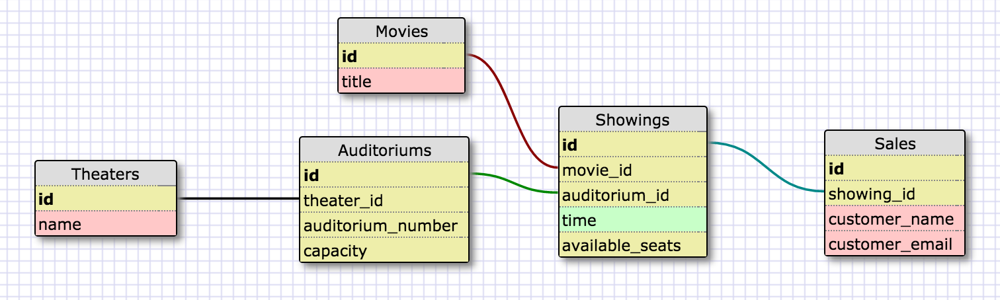

# Rails Theater
Allow users to check movie times and buy tickets to the movies.

Allow managers to manage auditoriums, movie times, and keep track of sales.

# Summary
This project seeks to help movie theater managment manage showings and sales at their movie theaters.

This projects also seeks to make buying tickets easier for users.

Currently CC data is not stored, as a CC processor is needed to handle CC security.

# Design Decisions
## Schema

There is no User model, but it could be implemented for repeat users to see which movies they've been.

## Security
Admin logins need a protected password. I chose to use ActiveModel's has_secure_password because it is built into rails and there will probably be not many additional admin accounts to be created.

If a User model were to be created I would use devise to more adequately protect users and their passwords in the database.

## TDD

# Future Improvements

# Deployment Instructions

